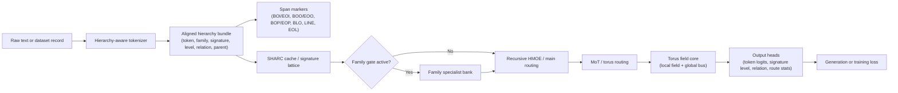

# EPIC-SHARC MOHTE Architecture Overview

EPIC-SHARC MOHTE stands for:

`Emitter Prismal Instructional Core with Signature-Hierarchy Attention Routing Cache + Mixture of Hierarchical Toroidal Experts`

This document tracks the current repository architecture rather than the earliest concept sketch. The implementation now combines hierarchical token/signature encoding, routing caches, nested torus experts, precision tiers, and generation-time caches into one stack.

## System Summary

At a high level, the model processes text through these stages:

1. Text is tokenized into aligned token and signature tracks.
2. SHARC-style routing uses signature hierarchy, family IDs, and lattice cache state to choose how a sequence is handled.
3. The routed signal enters a torus-based memory core.
4. Optional family specialists and recursive HMOE nests provide extra capacity for specific regions of the signature space.
5. The output heads produce token logits plus auxiliary signature-related losses and routing statistics.

The important point is that this is no longer just "a torus with attention language." The current codebase is a layered hierarchy of routing, memory, precision, and quantization components.

## Core Representation

The model does not only consume `input_ids`. It also tracks aligned side channels through the full sequence:

- `token_ids`
- `signature_ids`
- `signature_level_ids`
- `signature_relation_ids`
- `parent_signature_ids`
- `signature_family_ids`
- `loss_mask`

These tracks are constructed in `data.py` and validated by the model before training or generation proceeds. That alignment is one of the strongest invariants in the repo.

The main signature hierarchy levels currently include:

- `char`
- `piece`
- `word`
- `phrase`
- `line`
- `special`

In addition to those levels, the tokenizer and data pipeline use boundary and structure designators to mark larger spans such as blocks, paragraphs, and input/output regions. The most visible ones are:

- `<BOI>` and `<EOI>` for input-span boundaries
- `<BOO>` and `<EOO>` for outer block or output-style boundaries
- `<BOP>` and `<EOP>` for paragraph or prompt-style boundaries
- `<BLO>` for block/line-oriented structure
- `<LINE>` and `<EOL>` for line flow and line termination
- `<SPACE>` and `<TAB>` for whitespace structure
- `<CAP>` and `<UPPER>` for case structure
- `<SIG:OTHER>` for fallback structural/signature cases

Those specials do not replace the core levels. They add extra designators so the hierarchy can distinguish full spans, paragraph-like blocks, and other structural boundaries with more precision.

## Main Layers

### 1. Token and Data Layer

`data.py` builds the hierarchy-aware dataset representations.

It is responsible for:

- turning raw records into training text
- detecting prompt/response style records
- inserting span markers for input and output boundaries
- building signature and family metadata
- producing aligned labels and masks
- supporting text-window, streaming, and memmap-style dataset paths
- inserting structure markers for block, paragraph, line, and input/output spans when building hierarchy bundles

This layer is what makes the model aware of more than just byte-level token order.

### 2. SHARC Routing Layer

SHARC is the Signature Hierarchy Attention Routing Cache.

In the current implementation, SHARC-like behavior includes:

- signature-lattice attention
- cached routing state for generation
- family and level conditioning
- signature-family target construction for auxiliary heads

The routing cache exists to make repeated token handling more coherent during both training and inference.

### 3. Family Specialist Layer

The model now has an explicit family-specialist path.

In practice this means:

- family gates can route work to a specialist bank
- a per-family torus path can be enabled
- family budgets, hit rates, and gate means are tracked in `route_stats`
- the model can favor specialists when a signature family is confident enough

This is a meaningful change from a simpler one-router design. The current architecture is closer to a hierarchy of selective experts than a single flat backbone.

### 4. Torus Memory Layer

The Prismal Torus Core is the main spatial memory substrate.

It is organized as a 3D torus with:

- depth
- height
- width

Its responsibilities include:

- local field reads and writes
- global bus style persistent memory
- relay and scout-style read/write behavior
- recurrent solver or chunked-step refinement
- reusable operator and slot interaction with strength, decay, and activity controls

The torus is the memory backbone of the model. The bus gives it longer-lived sequence state, while local field updates keep it responsive to nearby context.

### 5. Recursive HMOE and Hierarchical Nesting

The current configuration also supports recursive hierarchical nesting.

That layer provides:

- nested torus scales per level
- smaller child torus configurations
- reduced depth and width deeper in the hierarchy
- per-level dimension scaling for the nested blocks

This is why the repo includes both HMOTE and recursive HMOE flags. They are not just aliases; they let the architecture express a stack of specialized submodels rather than one uniform block.

### 6. Mixture of Torus / Expert Routing

MOHTE acts as the specialization layer on top of the torus backbone.

It currently includes:

- top-k expert selection
- routing temperature controls
- balance and mixture losses
- path exploration via multiple routing paths

This part of the system is what keeps the architecture from collapsing into a single dense transformation. It is designed to preserve specialization while still allowing shared memory.

### 7. Precision and Quantization Layer

The current codebase has a much more explicit precision stack than the original overview implied.

It includes:

- hierarchical precision tiers
- root, mid, and leaf dtype controls
- BF16 and float8-style execution paths where supported
- bitsandbytes leaf precision support
- quantization-aware training scheduling
- cached quantized modules and cache refresh hooks

The idea is not just compression. It is a budgeted execution strategy that lets different parts of the stack run at different precision levels.

## Data Flow

The simplified runtime flow is:

In practice:

1. Text is tokenized and converted into aligned hierarchy tracks.
2. The model resolves runtime vocab and signature sizes from the tokenizer or checkpoint state.
3. Routing state determines whether a family specialist or the main torus path should dominate.
4. The torus core performs local and global memory updates.
5. Recursive and speculative paths can refine the output before final logits are produced.
6. Auxiliary signature and routing losses help keep the hierarchy coherent.

## Training And Generation

`train.py` now acts as the orchestration layer for the whole system.

It handles:

- tokenizer construction and caching
- dataset splitting and loading
- precision policy setup
- optimizer routing
- checkpoint save and restore
- runtime size inference from checkpoint state
- evaluation and benchmark helpers
- post-training prompt generation

Generation supports:

- beam search
- speculative decoding
- signature-lattice generation cache reuse
- optional SHARC disabling for ablation-style comparisons
- carried lattice-state reuse during decoding

That means the same architecture can be exercised in a few different ways without changing the model definition itself.

## What The Current Config Exposes

`config.py` is effectively the live schema for the architecture.

Some of the most important families of knobs are:

- model size: `d_model`, `n_layers`, `ff_mult`
- routing capacity: `n_emitters` as a reusable operator bank, `n_slots`, `top_k_emitters`, `top_k_slots`
- hierarchy routing control: `emitter_hierarchy_score_weight`
- torus shape: `torus_depth`, `torus_height`, `torus_width`
- bus and relay behavior: `torus_global_bus_slots`, `torus_global_bus_decay`, `torus_global_bus_write_scale`
- family routing: `family_budget`, `family_specialist_bank_size`, `family_specialist_gate_threshold`
- family specialists: `family_specialist_d_model`, `family_specialist_bank_size`
- recursive hierarchy: `hierarchical_nest_depth`, `recursive_hmoe_depth`, `recursive_hmoe_branching`
- signature lattice: `signature_lattice_dim`, `signature_lattice_buckets`, `signature_lattice_candidates`
- precision and quantization: `hierarchical_precision_*`, `use_bitsandbytes_leaf_precision`, `use_turbo_quantization`
- generation behavior: `use_speculative_decoding`, `speculative_draft_tokens`, `speculative_temperature`
- boundary handling: span-role logic in `data.py`, `use_pronunciation_signatures`, `signature_lattice_chunk_len`

If you are trying to understand why the model behaves a certain way, these are the knobs that matter first.

## Why The Torus Still Matters

The toroidal geometry is still a real design choice, not just branding.

It gives the model:

- wrapped state rather than edge-limited state
- repeated refinement over the same memory field
- a natural place for bus-like persistent sequence memory
- a geometry that works well with iterative solver-style updates

The model is trying to balance three things at once:

1. Expressivity
   - enough routing and expert capacity to represent complex structure
2. Stability
   - enough coherence that generation remains readable and trainable
3. Efficiency
   - sparse routing, quantization, and selective activation to keep the model feasible

## Practical Reading Order

If you want to understand the system from the outside in, read it in this order:

1. `README.md`
2. `ARCHITECTUREOVERVIEW.md`
3. `config.py`
4. `data.py`
5. `model.py`
6. `train.py`

That path moves from the conceptual model, to the live configuration schema, to the actual routing and memory code that implements the architecture.
