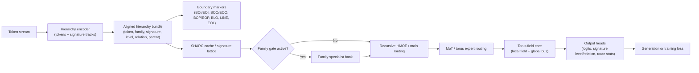

# EPIC-SHARC MOHTE v0.3.4

v0.3.4 Update Notes

- Added an explicit Blackwell NVFP4 leaf backend through Transformer Engine
- Kept the Ada float8 path separate from bitsandbytes so supported float8 stays float8
- Tightened bitsandbytes leaf compute dtype handling to valid compute dtypes only
- Added CLI flags, README notes, and architecture docs for Ada and Blackwell precision paths
- Added focused tests for float8 resolution, bitsandbytes limits, and NVFP4 recipe locking

EPIC-SHARC MOHTE GATE

Guided Activations Through Emitters
A predictive parameter residency controller that uses:

Signature state
Family/level/relation hierarchy
Path/lane routing state
Recent emitter usage
Lattice cache contents

to predict which parameter tiles should be present on GPU for the next token, next chunk, or next path segment.

Not single weights.
Not even single emitter rows at first.
Tiles.

## Definition

Emitter Prismal Instructional Core with Signature-Hierarchy Attention Routing Cache + Mixture of Hierarchical Toroidal Experts + Guided Activations Through Emitters.

This repository contains the EPIC-SHARC MOHTE standalone implementation of the routing, memory, and toroidal expert components.
A tiny demo corpus is bundled at [`demo/corpus/tiny_example.txt`](./demo/corpus/tiny_example.txt) so the quickstart runs out of the box. For real work, choose your own text, JSONL, Parquet, or Markdown corpus in the UI or pass it on the command line.

## Licensing

**EPIC-SHARC MOHTE** is source-available under the **GNU AGPLv3** for non-commercial use. Non-commercial use includes research, personal projects, academics, and non-profits.

Commercial use requires a paid license. Companies, SaaS products, internal tools, or any revenue-generating deployment must obtain a commercial license from the author.

See [LICENSE](./LICENSE), [COMMERCIAL.md](./COMMERCIAL.md), and [LICENSES.md](./LICENSES.md) for full details.

## Install

```bash
python -m pip install -r requirements.txt
```

The core runtime depends on `numpy` and `torch`. Optional data-path helpers can also use `pandas`, `pyarrow`, `bitsandbytes`, or Transformer Engine if you install them.

For Blackwell users who want NVFP4 leaf precision, install Transformer Engine and use the explicit NVFP4 leaf backend flags. That path is optional and requires SM100+ hardware.

## Overview

The architecture is built around a hierarchy-aware tokenizer, a SHARC-style routing cache, torus memory, and reusable operator emitters. The boundary markers carry span structure for input/output segments and paragraph-like blocks:

- `<BOI>` and `<EOI>` mark input spans
- `<BOO>` and `<EOO>` mark output spans
- `<BOP>` and `<EOP>` mark paragraph or block boundaries
- `<BLO>`, `<LINE>`, and `<EOL>` annotate lower-level structural flow

The full flow looks like this:



For the detailed architecture writeup, see [`ARCHITECTUREOVERVIEW.md`](./ARCHITECTUREOVERVIEW.md).

## Default Configuration

The default runtime configuration lives in [`config.py`](./config.py) via `PrismalWaveConfig`.

Key defaults:

- `d_model = 1024`
- `n_layers = 1`
- `n_emitters = 64`
- `n_slots = 2048`
- `n_paths = 1`
- `emitter_hierarchy_score_weight = 0.25`
- `use_factorized_embedding = true`
- `use_turbo_quantization = false`
- `use_torus_core = true`
- `Torus_SHARC_Router = true`
- `use_hmote = true`
- `use_recursive_hmoe = true`
- `use_signature_lattice_attention = true`
- `use_signature_lattice_generation_cache = true`
- `use_torus_race_lanes = true`
- `use_speculative_decoding = true`

Precision support is backend-specific:

- Ada-class GPUs can use the hierarchical float8 path where supported
- bitsandbytes leaf precision stays limited to `float16`, `bfloat16`, and `float32` compute
- Blackwell-class GPUs can opt into Transformer Engine NVFP4 leaf precision, which requires SM100+ and the explicit `nvfp4` recipe

### Blackwell Setup

For Blackwell / SM100+ systems, install Transformer Engine and enable the NVFP4 leaf backend explicitly:

```bash
python -m pip install transformer-engine
python cli.py train --use-transformer-engine-leaf-precision --transformer-engine-leaf-recipe nvfp4 --transformer-engine-leaf-params-dtype bfloat16
```

The NVFP4 path is separate from bitsandbytes leaf precision. Use it only when the hardware and Transformer Engine backend are present.

## Core Modules

The main code paths are:

- `./data.py` for hierarchy encoding and loss-mask construction
- `./model.py` for torus routing, lattice attention, and decoding
- `./train.py` for training, checkpoint loading, and prompt generation
- `./quantization.py` for cached TurboQuant wrappers plus Ada/Blackwell precision backends

## Data Alignment

The model expects these tensors to stay aligned at the boundary:

- `input_ids`
- `signature_ids`
- `signature_level_ids`
- `signature_relation_ids`
- `parent_signature_ids`
- `signature_family_ids`
- `loss_mask`

If one of those drifts, the model raises immediately in `forward()` or `generate()` rather than silently training on misaligned data.

## Run It

```bash
python cli.py train --data <your-data-path> --save-dir checkpoints/demo
python cli.py train --data <your-data-path> --save-dir checkpoints/demo --use-gradient-accumulation --gradient-accumulation-steps 4
python cli.py infer --checkpoint checkpoints/demo/model.pt --prompt "Explain torus routing"
python cli.py benchmark --data <your-data-path>
python gui.py
```

## Try It In 60 Seconds

```bash
python cli.py train --data demo/corpus --save-dir checkpoints/tiny --use-gradient-accumulation --gradient-accumulation-steps 4
python cli.py infer --checkpoint checkpoints/tiny/model.pt --prompt "Explain the torus core."
```

Expected result: a short training log, a saved checkpoint under `checkpoints/tiny/`, and a brief generated response from the prompt.

## Tiny Matrix Runs

For quick routing-stability tests, use [`tiny_training_matrix.py`](./tiny_training_matrix.py):

```bash
python tiny_training_matrix.py screen
python tiny_training_matrix.py confirm --from-summary checkpoints/tiny_training_matrix/<timestamp>/screen_summary.json --top 2
python tiny_training_matrix.py followup --checkpoints checkpoints/tiny_training_matrix/<timestamp>/confirm/<dataset>/<variant> --benchmark-data pretokenized/DictWords_synthetic_sentences
```

The script keeps the optimizer and precision stack fixed, varies only the torus/routing knobs, and writes per-run summaries with validation loss plus routing metrics.

## Input Format

- Training data can be JSONL, Parquet, Markdown, plain text, or a dataset folder.
- Each record is converted into a hierarchical text window.
- The tokenizer can emit `<BOO>`, `<EOO>`, `<BOP>`, `<EOP>`, `<BLO>`, `<LINE>`, `<EOL>`, and `<SIG:OTHER>` special tokens.
- These markers add structure for blocks, paragraphs, and line boundaries, with `<SIG:OTHER>` covering fallback structural cases.
- The hierarchy encoder also produces aligned signature-family, signature-level, relation, and parent-ID tracks for every token, and the operator router consumes those tracks directly with a dedicated hierarchy score weight.
- For a tiny local demo workflow, see [`demo/pretokenizedemo.md`](./demo/pretokenizedemo.md).
- The shipped sample corpus lives in [`demo/corpus/tiny_example.txt`](./demo/corpus/tiny_example.txt); you can point `train`, `benchmark`, or `pretokenize.py` at `demo/corpus/` directly.

## Code Map

If you want to inspect the implementation, start here:

- `./data.py`
- `./model.py`
- `./train.py`

