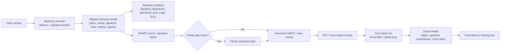

# EPIC-SHARC MOHTE v0.3.5

v0.3.5 Update Notes

- Reworked token memory to use a circular buffer instead of shifting the whole window on append
- Added cached token counts so copy-bias lookup no longer rescans the full memory window every step
- Made token-memory confidence use a real top-1 vs top-2 margin, so `token_memory_top_k = 1` still produces meaningful gating
- Skipped token-memory copy and anchor bookkeeping during training by default, keeping that overhead on the generation side unless explicitly enabled
- Added smoke coverage for the confidence margin behavior and the training-mode copy skip
- Kept the existing precision-path work from v0.3.4 intact, including explicit NVFP4 leaf support and the float8 backend split
- Compressed hierarchy vectors to a 4D low-rank path by default, with float8/bfloat16 storage and loading support through `ml_dtypes`
- Added torchao-backed weight-only acceleration for the common quantized linear and embedding paths, with Windows-safe fallbacks when Triton is unavailable
- Removed the obsolete `learned_hierarchy_vector_dim` config path so the hierarchy width is now controlled by the low-rank settings only
- Fixed the Fast-Slow Training prefix leak so inference no longer inherits the training prefix unless `fast_context_state` is passed explicitly

EPIC-SHARC MOHTE GATE

Guided Activations Through Emitters
A predictive parameter residency controller that uses:

Signature state
Family/level/relation hierarchy
Path/lane routing state
Recent emitter usage
Lattice cache contents

to predict which parameter tiles should be present on GPU for the next token, next chunk, or next path segment.

Not single weights.
Not even single emitter rows at first.
Tiles.

## Definition

Emitter Prismal Instructional Core with Signature-Hierarchy Attention Routing Cache + Mixture of Hierarchical Toroidal Experts + Guided Activations Through Emitters.

This repository contains the EPIC-SHARC MOHTE standalone implementation of the routing, memory, and toroidal expert components.
A tiny demo corpus is bundled at [`demo/corpus/tiny_example.txt`](./demo/corpus/tiny_example.txt) so the quickstart runs out of the box. For real work, choose your own text, JSONL, Parquet, or Markdown corpus in the UI or pass it on the command line.

## Licensing

**EPIC-SHARC MOHTE** is source-available under the **GNU AGPLv3** for non-commercial use. Non-commercial use includes research, personal projects, academics, and non-profits.

Commercial use requires a paid license. Companies, SaaS products, internal tools, or any revenue-generating deployment must obtain a commercial license from the author.

See [LICENSE](./LICENSE), [COMMERCIAL.md](./COMMERCIAL.md), and [LICENSES.md](./LICENSES.md) for full details.

## Install

```bash
python -m pip install -r requirements.txt
```

The core runtime depends on `numpy`, `torch`, `ml_dtypes`, and `torchao`. Optional data-path helpers can also use `pandas`, `pyarrow`, `bitsandbytes`, or Transformer Engine if you install them.

For Blackwell users who want NVFP4 leaf precision, install Transformer Engine and use the explicit NVFP4 leaf backend flags. That path is optional and requires SM100+ hardware.

## Overview

The architecture is built around a hierarchy-aware tokenizer, a SHARC-style routing cache, torus memory, and reusable operator emitters. The boundary markers carry span structure for input/output segments and paragraph-like blocks:

- `<BOI>` and `<EOI>` mark input spans
- `<BOO>` and `<EOO>` mark output spans
- `<BOP>` and `<EOP>` mark paragraph or block boundaries
- `<BLO>`, `<LINE>`, and `<EOL>` annotate lower-level structural flow

The full flow looks like this:


```mermaid
flowchart LR
    T["Token stream"] --> H["Hierarchy encoder<br/>(tokens + signature tracks)"]
    H --> B["Aligned hierarchy bundle<br/>(token, family, signature, level, relation, parent)"]
    B --> M["Boundary markers<br/>(BOI/EOI, BOO/EOO, BOP/EOP, BLO, LINE, EOL)"]
    B --> C["SHARC cache / signature lattice"]
    C --> G{"Family gate active?"}
    G -->|Yes| S["Family specialist bank"]
    G -->|No| R["Recursive HMOE / main routing"]
    S --> R
    R --> X["MoT / torus expert routing"]
    X --> F["Torus field core<br/>(local field + global bus)"]
    F --> O["Output heads<br/>(logits, signature level/relation, route stats)"]
    O --> P["Generation or training loss"]
```

For the detailed architecture writeup, see [`ARCHITECTUREOVERVIEW.md`](./ARCHITECTUREOVERVIEW.md).

## Default Configuration

The default runtime configuration lives in [`config.py`](./config.py) via `PrismalWaveConfig`.

Key defaults:

- `d_model = 128`
- `n_layers = 1`
- `n_emitters = 256`
- `n_slots = 128`
- `n_paths = 1`
- `emitter_hierarchy_score_weight = 0.25`
- `use_factorized_embedding = true`
- `use_turbo_quantization = false`
- `use_torus_core = true`
- `Torus_SHARC_Router = true`
- `use_hmote = false`
- `use_recursive_hmoe = false`
- `hierarchical_nest_depth = 1`
- `torus_chunk_len = 1`
- `signature_lattice_chunk_len = 1`
- `use_signature_lattice_attention = true`
- `use_signature_lattice_generation_cache = true`
- `use_sparse_emitter_routing = true`
- `router_sparse_candidate_budget = 256`
- `use_torus_race_lanes = true`
- `use_speculative_decoding = true`

Set `--no-sparse-emitter-routing` if you want the older dense emitter scoring path for ablations.

Training and generation share a token-by-token output hierarchy transition. Prompt spans may retain complete observed signatures; answer features use only the emitted prefix. Hierarchy normalization capacities are frozen after tokenizer fitting and saved with the checkpoint. Legacy pretokenized arrays must be rebuilt for this protocol. See [`CAUSAL_PROTOCOL_RESTORATION.md`](./review_artifacts/CAUSAL_PROTOCOL_RESTORATION.md) for the changes and checks.

Leading `input: … output: …` QA records are normalized into explicit input/output spans before tokenizer fitting and encoding. Only the answer span is supervised. Explicit generation prompts such as `<BOI>question<EOI><BOO>` are preserved without adding duplicate boundaries. Rebuild pretokenized QA datasets and refit tokenizers made before this normalization change; existing checkpoint weights do not acquire the corrected task automatically.

Inference defaults to answering a question. To continue a raw document inside its output span, use `python cli.py infer --checkpoint <model.pt> --prompt "Document prefix " --prompt-mode continuation`. The Python API accepts `generate_text(..., prompt_mode="continuation")`. Preserve trailing whitespace when the next token starts a new word. The all-category NVIDIA evaluation now selects complete-word document prefixes, uses the appropriate mode, and records raw continuations separately from decoder cleanup.

Codec 10 registers every construction unit's intrinsic signature independently of the optional word/line profile budget and preserves signature IDs through tokenizer extension and save/load. Fresh registry family tables are sized by family count; parent tables are sized by signature count. Existing checkpoints retain their trained table shapes and tokenizer mappings. Ordinary generation now advances a request-local causal hierarchy state instead of replaying the output prefix for each token; beam and speculative paths retain replay. Refit and retrain to evaluate corrected intrinsic signatures—loading old weights alone does not repair missing trained features.

Fresh models can opt into the shared component table and verified greedy continuation proposals with `--signature-representation compositional_v1 --verified-signature-spans`. The new representation shares feature parameters across routing and memory consumers instead of learning separate signature/parent tables. Proposals use training-only evidence and per-slot verification; every emitted token still advances the torus. See [Compositional signatures v1](./COMPOSITIONAL_SIGNATURES_V1.md) for behavior, configuration, validation and current limits.

`--signature-representation compositional_v2` adds causal runtime properties for unfamiliar and partial words, bypassing whole-profile registration in root hierarchy conditioning and torus parent context. Use fresh training with individual tokens and ordinary decoding. See [Runtime compositional signatures v2](./COMPOSITIONAL_SIGNATURES_V2.md) for state handling, supported modes, and the held-out recombination control (4/8 exact versus v1's 2/8; fruit rule selection remains unresolved).

Precision support is backend-specific:

- Ada-class GPUs can use the hierarchical float8 path where supported
- torchao can accelerate the common quantized linear and embedding paths without Triton, including on Windows, while preserving a manual fallback path
- bitsandbytes leaf precision stays limited to `float16`, `bfloat16`, and `float32` compute
- Blackwell-class GPUs can opt into Transformer Engine NVFP4 leaf precision, which requires SM100+ and the explicit `nvfp4` recipe

### Blackwell Setup

For Blackwell / SM100+ systems, install Transformer Engine and enable the NVFP4 leaf backend explicitly:

```bash
python -m pip install transformer-engine
python cli.py train --use-transformer-engine-leaf-precision --transformer-engine-leaf-recipe nvfp4 --transformer-engine-leaf-params-dtype bfloat16
```

The NVFP4 path is separate from bitsandbytes leaf precision. Use it only when the hardware and Transformer Engine backend are present.

## Core Modules

The main code paths are:

- `./data.py` for hierarchy encoding and loss-mask construction
- `./model.py` for torus routing, lattice attention, and decoding
- `./train.py` for training, checkpoint loading, and prompt generation
- `./quantization.py` for cached TurboQuant wrappers, torchao weight-only acceleration, and Ada/Blackwell precision backends

## Data Alignment

The model expects these tensors to stay aligned at the boundary:

- `input_ids`
- `signature_ids`
- `signature_level_ids`
- `signature_relation_ids`
- `parent_signature_ids`
- `signature_family_ids`
- `loss_mask`

If one of those drifts, the model raises immediately in `forward()` or `generate()` rather than silently training on misaligned data.

## Run It

```bash
python cli.py train --data <your-data-path> --save-dir checkpoints/demo
python cli.py train --data <your-data-path> --save-dir checkpoints/demo --use-gradient-accumulation --gradient-accumulation-steps 4
python cli.py infer --checkpoint checkpoints/demo/model.pt --prompt "Explain torus routing"
python cli.py benchmark --data <your-data-path>
python gui.py
```

## Try It In 60 Seconds

```bash
python cli.py train --data demo/corpus --save-dir checkpoints/tiny --use-gradient-accumulation --gradient-accumulation-steps 4
python cli.py infer --checkpoint checkpoints/tiny/model.pt --prompt "Explain the torus core."
```

Expected result: a short training log, a saved checkpoint under `checkpoints/tiny/`, and a brief generated response from the prompt.

## Tiny Matrix Runs

For quick routing-stability tests, use [`tiny_training_matrix.py`](./tiny_training_matrix.py):

```bash
python tiny_training_matrix.py screen
python tiny_training_matrix.py confirm --from-summary checkpoints/tiny_training_matrix/<timestamp>/screen_summary.json --top 2
python tiny_training_matrix.py followup --checkpoints checkpoints/tiny_training_matrix/<timestamp>/confirm/<dataset>/<variant> --benchmark-data pretokenized/DictWords_synthetic_sentences
```

The script keeps the optimizer and precision stack fixed, varies only the torus/routing knobs, and writes per-run summaries with validation loss plus routing metrics.

## Input Format

- Training data can be JSONL, Parquet, Markdown, plain text, or a dataset folder.
- Each record is converted into a hierarchical text window.
- The tokenizer can emit `<BOO>`, `<EOO>`, `<BOP>`, `<EOP>`, `<BLO>`, `<LINE>`, `<EOL>`, and `<SIG:OTHER>` special tokens.
- These markers add structure for blocks, paragraphs, and line boundaries, with `<SIG:OTHER>` covering fallback structural cases.
- The hierarchy encoder also produces aligned signature-family, signature-level, relation, and parent-ID tracks for every token, and the operator router consumes those tracks directly with a dedicated hierarchy score weight.
- For a tiny local demo workflow, see [`demo/pretokenizedemo.md`](./demo/pretokenizedemo.md).
- The shipped sample corpus lives in [`demo/corpus/tiny_example.txt`](./demo/corpus/tiny_example.txt); you can point `train`, `benchmark`, or `pretokenize.py` at `demo/corpus/` directly.

## Code Map

### Optional CUDA transition repair

Training can use `--training-finite-guard-backend cuda` (or set
`training_finite_guard_backend="cuda"` in the model config) when CuPy and CUDA
are available. The default is `sync`. CPU and inference retain the original
guard. CUDA kernels compile on first use; benchmark after warmup.

This backend checks and repairs each transition before the next token uses it,
keeps repair counts on the GPU, and implements backward gradients for both the
input and hidden-state fallback. It allocates fresh outputs even when values
are finite, so healthy tensor identity is not preserved. It never mutates
transition inputs. One-token causal scheduling stays unchanged.

CuPy is optional (`cupy-cuda12x` for CUDA 12). Selecting this backend without
CuPy raises an error. On the local RTX 4070 SUPER real 32 × 257 batch, the guard
removed 257 per-token host reads; two forward/backward comparisons measured
about 4% faster and 3% slower, so there is no reliable throughput gain yet.
Measure your workload before adopting it. Use
`--training-finite-guard-backend sync` to restore the original backend.

### Batched token-local torus inputs

Training now prepares write coordinates, stencil weights, write deltas, and
state-independent gates for the whole sequence before scanning the recurrent
field and bus. Every token still reads, updates, repairs, and passes its state
to the next token in order; the finite guard and one-token schedule are intact.

`training_precompute_torus_inputs` defaults to `true`. The optimization applies
to the plain torus core with dense, unhooked projections, one-token chunks, no
fixed-point solver, and no gradient checkpointing. Other paths and inference
retain their existing execution. Use `--no-precompute-torus-inputs` to disable
it, or `--precompute-torus-inputs` to explicitly enable it when resuming.

Two local real 32 × 257 batch comparisons on the RTX 4070 SUPER measured
forward/backward median throughput gains of 1.30× and 1.85×. Linear calls fell
from 4,171 to 1,323. Timings vary; these measurements exclude optimizer updates
and data loading. Loss matched exactly, parameter gradients and route stats
passed comparison, and logits differed by at most 0.0014 under the existing
precision policy because batched GEMMs can round differently. No additional
CUDA library is needed.

The prepared path also batches patch indices, write multipliers, and stencil
entropy/effective-count statistics. Patch-index construction runs once per path
and its result is reused for both field reads. `training_precompute_torus_metadata`
defaults to `true`; set it to `false` in config to retain only the earlier
projection batching. This extension measured another 1.19× and 1.45×
forward/backward throughput over that earlier optimized path in two local
comparisons. The state-dependent recurrence remains sequential.

If you want to inspect the implementation, start here:

- `./data.py`
- `./model.py`
- `./train.py`

